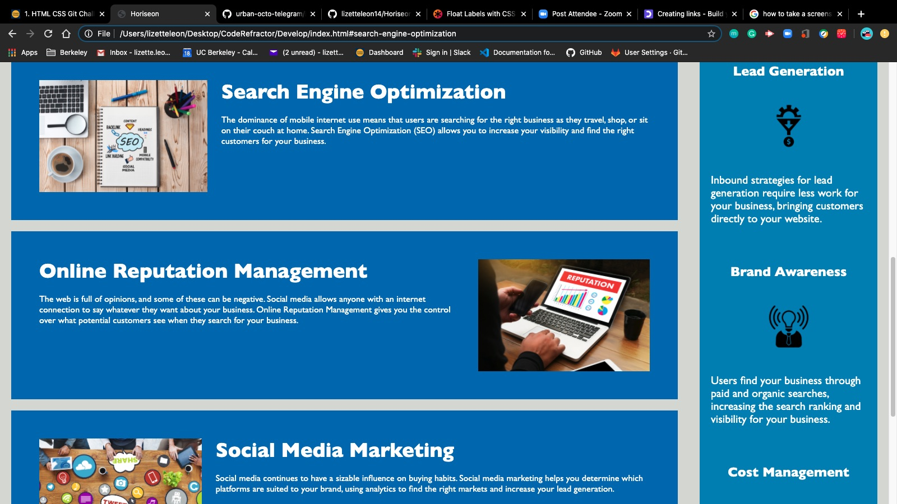
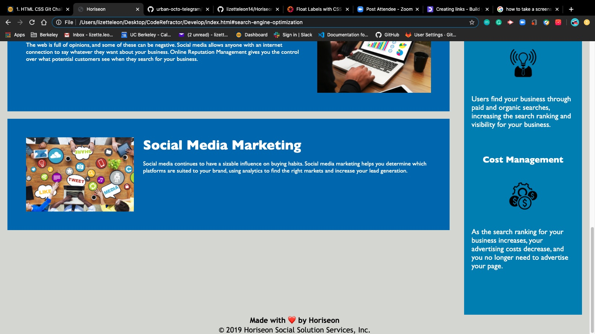

# Who is Horiseon?

<!DOCTYPE html>

<html lang="en-us">
    <head>
        <meta charset="UTF-8" />
    </head>
    <header>
        <h2>
            Description
        </h2>
            

                Provide potential customers information about services provided by Horiseon. In this challenge I made adjustments to the structure of the HTML code, I also reorganized and made comments to the CSS file in order to demonstrate a semantic structure.
            

    <header>
    <section>
      
      
      
    </section>
    <section>
        

            The URL of the deployed application
            <a href="https://lizetteleon14.github.io/Horiseon"/>The URL of the deployed application</a>
        

    </section>
    <section>
        

            The URL of the GitHub repository 
            <a href="https://github.com/lizetteleon14/Horiseon">The URL of the Git</a>
        

    </section>
    

    

